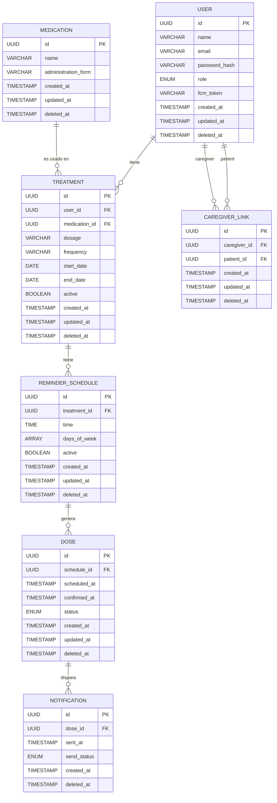

# Diagrama de entidad-relación

Basado en el [diccionario de datos](../README.md#diccionario-de-datos) del README.

```mermaid
erDiagram
    USER ||--o{ TREATMENT : "tiene"
    USER ||--o{ CAREGIVER_LINK : "caregiver"
    USER ||--o{ CAREGIVER_LINK : "patient"
    MEDICATION ||--o{ TREATMENT : "es usado en"
    TREATMENT ||--o{ REMINDER_SCHEDULE : "tiene"
    REMINDER_SCHEDULE ||--o{ DOSE : "genera"
    DOSE ||--o{ NOTIFICATION : "dispara"

    USER {
        UUID id PK
        VARCHAR name
        VARCHAR email
        VARCHAR password_hash
        ENUM role
        VARCHAR fcm_token
        TIMESTAMP created_at
        TIMESTAMP updated_at
        TIMESTAMP deleted_at
    }

    MEDICATION {
        UUID id PK
        VARCHAR name
        VARCHAR administration_form
        TIMESTAMP created_at
        TIMESTAMP updated_at
        TIMESTAMP deleted_at
    }

    TREATMENT {
        UUID id PK
        UUID user_id FK
        UUID medication_id FK
        VARCHAR dosage
        VARCHAR frequency
        DATE start_date
        DATE end_date
        BOOLEAN active
        TIMESTAMP created_at
        TIMESTAMP updated_at
        TIMESTAMP deleted_at
    }

    REMINDER_SCHEDULE {
        UUID id PK
        UUID treatment_id FK
        TIME time
        ARRAY days_of_week
        BOOLEAN active
        TIMESTAMP created_at
        TIMESTAMP updated_at
        TIMESTAMP deleted_at
    }

    DOSE {
        UUID id PK
        UUID schedule_id FK
        TIMESTAMP scheduled_at
        TIMESTAMP confirmed_at
        ENUM status
        TIMESTAMP created_at
        TIMESTAMP updated_at
        TIMESTAMP deleted_at
    }

    NOTIFICATION {
        UUID id PK
        UUID dose_id FK
        TIMESTAMP sent_at
        ENUM send_status
        TIMESTAMP created_at
        TIMESTAMP deleted_at
    }

    CAREGIVER_LINK {
        UUID id PK
        UUID caregiver_id FK
        UUID patient_id FK
        TIMESTAMP created_at
        TIMESTAMP updated_at
        TIMESTAMP deleted_at
    }
```
