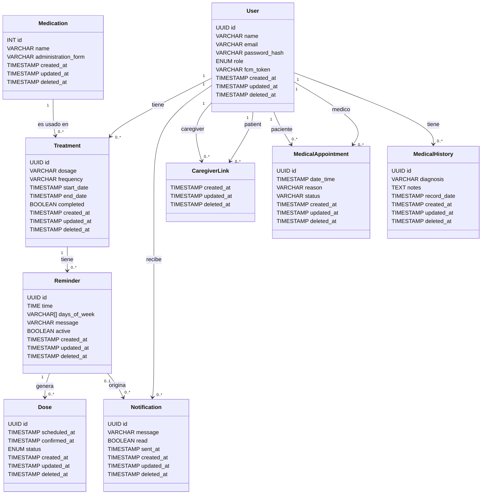

# Diagrama de entidad-relación

Basado en el [diccionario de datos](../README.md#diccionario-de-datos) del README.

> **Nota:** este diagrama está hecho en notación de clases UML (clase = entidad, atributos con tipo, líneas con multiplicidad `1` / `0..1` / `0..*` en cada extremo) en lugar de la notación "pata de cuervo" que habíamos usado antes. Si el profesor esperaba notación de Chen (entidades, relaciones y atributos como figuras separadas: rectángulos, rombos y óvalos), avisen para rehacerlo en ese formato; son notaciones distintas y preferimos confirmar antes de la próxima entrega.

## Notas sobre claves

- `Reminder` **no** es una fila por toma: es el patrón recurrente (hora del día + días de la semana) de un tratamiento. Cada toma real se modela en `Dose`, generada a partir de un `Reminder`. Ver la nota de diseño de `reminder` en el [diccionario de datos](../README.md#diccionario-de-datos).
- `CaregiverLink` no tiene `id` propio: su clave primaria es el par (`caregiver_id`, `patient_id`), porque es una tabla de vínculo puro entre dos `User` sin identidad propia más allá de esa relación.
- `Medication` usa `id` autoincremental (`INT`) en vez de `UUID`: es un catálogo compartido, de solo lectura para los usuarios, sin dueño individual ni dato sensible, no hay riesgo de enumeración/IDOR.
- Las demás clases usan `UUID` como clave surrogada porque representan datos de una persona expuestos individualmente por API, donde un ID secuencial permitiría enumerar/adivinar registros de otros usuarios (riesgo IDOR). Ver el criterio completo, tabla por tabla, en la nota de **Criterio de claves primarias** del [diccionario de datos](../README.md#diccionario-de-datos).
