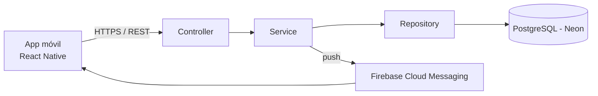

# Arquitectura del proyecto

## Arquitectura elegida

El backend sigue una arquitectura en capas (Controller → Service → Repository → Model), separando la exposición HTTP de la lógica de negocio y del acceso a datos:

- **Controller**: expone los endpoints REST y traduce entre DTOs y el dominio.
- **Service**: contiene la lógica de negocio y las reglas descriptas en el README (RN-01 a RN-08).
- **Repository**: acceso a datos vía JPA sobre las entidades del [esquema](../database/schema.sql).
- **Model**: entidades JPA que mapean 1 a 1 con las tablas del [diccionario de datos](../README.md#diccionario-de-datos).

## Tecnologías y justificación

| Capa | Tecnología | Justificación |
|---|---|---|
| Frontend / App móvil | React Native | Un mismo código para Android e iOS (RNF-01), evitando mantener dos bases nativas separadas. |
| Backend / API | Spring Boot (Java) | Framework maduro para APIs REST en capas, con soporte de primera clase para JPA, seguridad y testing. |
| Base de datos | PostgreSQL (hosteado en Neon) | Modelo relacional con relaciones y claves foráneas explícitas entre usuario, tratamiento, horarios y tomas; Neon evita administrar infraestructura propia. |
| Notificaciones push | Firebase Cloud Messaging (FCM) | Servicio multiplataforma (Android/iOS) para el envío de recordatorios (RF-06). |
| Autenticación | JWT propio | Mecanismo *stateless*, adecuado para un cliente móvil que no mantiene sesión de servidor. |
| Control de versiones | Git / GitHub | Repositorio único acordado para todo el equipo y el tutor. |

## Alcance de esta entrega

Para esta entrega, `/frontend` y `/backend` contienen únicamente la estructura de carpetas propuesta, sin implementación. El desarrollo del código comienza después de la aprobación del tutor, según lo pedido por la consigna.
